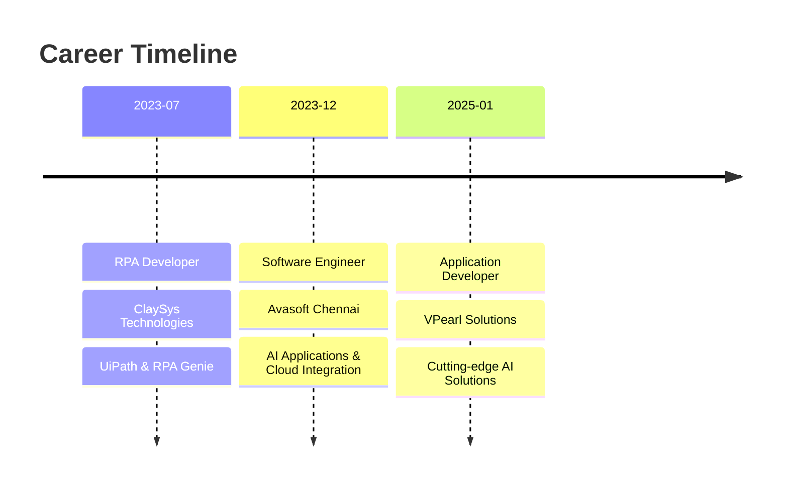

# 👋 Hello, I'm Thirumurugan Subramaniyan

  

---

## 🚀 About Me

> *"Transforming innovative ideas into impactful AI-driven solutions"*

🎓 **Computer Science Engineer** from Karpagam Academy of Higher Education, Coimbatore  
🌍 **Based in:** Chennai, Tamil Nadu, India  
💼 **Current Role:** Application Developer at VPearl Solutions Private Limited  
🎯 **Passion:** Leveraging technology to solve real-world problems through AI-powered applications  

### 🌟 What Drives Me
- 🤖 Crafting cutting-edge AI solutions using Azure OpenAI Service & AWS Bedrock
- 🔧 Building robust APIs and integrating complex systems
- 📊 Optimizing data structures and application performance
- 🎯 Delivering scalable applications through modern development practices

---

## 🛠️ Tech Arsenal

### Programming Languages

### Frameworks & Libraries

### AI & Cloud Platforms

### Databases

### Development Tools

---

## 🎯 Specialized Expertise

<table>
<tr>
<td width="50%">

### 🤖 AI & Machine Learning
- **RAG-based Solutions** implementation
- **LangChain** for AI application development
- **Vector Databases** for intelligent search
- **Generative AI Prompting** optimization
- **OCR Solutions** for multi-language support

</td>
<td width="50%">

### 🔧 Full-Stack Development
- **API Development** (REST & GraphQL)
- **Database Optimization** (SQL & NoSQL)
- **CI/CD Pipelines** implementation
- **Automation Testing** with Playwright
- **Web Scraping** solutions

</td>
</tr>
</table>

---

## 💼 Professional Journey

### 🏆 Key Projects

<b>🌐 LangTech Platform</b> - AI-Powered Translation Service

- **Duration:** January 2024 - Present
- **Tech Stack:** Python, JavaScript, OpenAI GPT, Google Gemini, Llama Models
- **Achievement:** Multi-language OCR with Vietnamese support
- **Impact:** Seamless content translation for global users

<b>☁️ CloudGen</b> - Drag-and-Drop Cloud Operations

- **Duration:** September 2024 - December 2024
- **Tech Stack:** React.js, Flask, AWS Bedrock, PostgreSQL, MongoDB
- **Achievement:** Simplified cloud service creation and deployment
- **Impact:** Streamlined cloud operations with cost estimation

<b>🏗️ LFS (AWS Well-Architected Framework)</b>

- **Duration:** March 2024 - April 2024
- **Tech Stack:** React.js, Flask, Azure OpenAI, PostgreSQL, MongoDB
- **Achievement:** AI-driven AWS framework review automation
- **Impact:** Dynamic business process optimization

---

## 🌟 Leadership & Beyond

### 🎖️ **Senior NCC Cadet**
*Leadership • Time Management • Teamwork*

### 🌱 **Personal Interests**
🌿 Gardening | 🎨 Paper Craft | 👨‍🍳 Cooking

*"These hobbies fuel my creativity and bring balance to my life"*

---

## 📊 GitHub Analytics

  

  

---

## 🤝 Let's Connect & Collaborate

---

### 💡 *"Innovation distinguishes between a leader and a follower"*

**Currently crafting the future of AI applications, one line of code at a time**

---

⭐ **If you find my work interesting, don't forget to star my repositories!** ⭐

